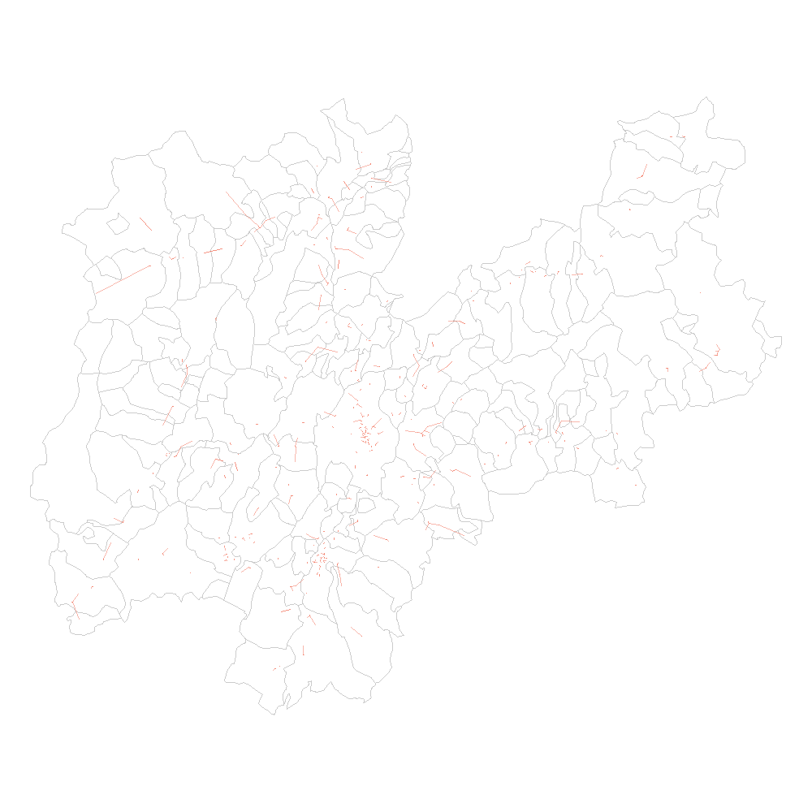

# Spatial Statistics and Regression about Schools in the Province of Trento

```{r message=FALSE, warning=FALSE}
# Libraries
library(tidyverse)
library(spdep)
library(rgdal)
library(sf)
library(sp)
library(rgeos)
library(terra)
```

## Reading data

The necessary data for this type of analysis are:

* the shapefile with the aggregated data per municipality about schools number, students, classes and population;
* a shapefile with every single school in the Province of Trento. 

Starting with municipalities, we can see the map of each of them inside the Province of Trento.

```{r}
# Change working directory
setwd("G:/Il mio Drive/2nd Year/Geospatial/TrentinoSchools/src")

# Import 
# Read municipality data
tn <- readOGR("../data/aggregated_data_per_municipality")
tn <- spTransform(tn, CRS("+init=epsg:4326"))

# Plot the municipalities in Trentino
par(mar=c(0,0,0,0))
plot(tn, axes = 1, border="grey")
```

Regarding the second file, the one with schools, it is necessary to transform the spatial dataframe by setting the proper CRS
```{r}
# Import shapefile as SpatialPointsDataFrame
schools <- readOGR("../data/Trentino/schools/schools.shp",
    verbose = FALSE
)
schools <- spTransform(schools, CRS("+init=epsg:4326"))

# Plot schools over Trentino's map
par(mar=c(0,0,0,0))
plot(tn, border = "grey", axes = F)
points(schools@coords, col = "cornflowerblue", cex = 1, pch = 1)
```

## Descriptive spatial statistics (global analysis) 

### Centroids

Before starting with the global analysis of Trentino municipalities, it is necessary to select some representative points for each municipality as unique reference to the spatial coordinate. Commonly, the centroid is a good choice, but still some problems can emerge and the centroid may not fall inside the boundaries of the territory. 
In this particular case, this may happen with multipolygons shape, i.e. those municipalities that contain territories with multiple boundaries, not just one single space. Some examples are the municipalities of Tione di Trento, Ronzone, Stenico, Calliano, Pellizzano and Riva del Garda. Some municipalities, as Luserna, find their centroid in another territory because of their shape. 

```{r}
par(mar=c(0,0,0,0))
plot(tn)
points(coordinates(tn), 
       col="red", 
       bg = "#EF798A", 
       pch = 21,  
       lwd = 1.5)

```
Instead of recurring to `coordinates()`, we could use `gCentroid` to obtain an alternative version of centroids. For most of the cases, these two versions coincide, but for those municipalities with multiple polygons points may differ (e.g. Soraga di Fassa in the upper right part). Since it computes a sort of mean point, making the centroid being part of other territories, the rest of the notebook will relate to the previous version (i.e. `coordinates`), despite inaccurate in some cases. 

```{r}
par(mar=c(0,0,0,0))
trueCentroids = gCentroid(tn,byid=TRUE)
plot(tn)
points(coordinates(tn),pch=1, col="blue")
points(trueCentroids,pch=2, col="red")
```

*Note that, instead, school dataset contains points and not polygons, therefore no problem occurs with the centroid computation. Also, since many schools have same coordinates because in the same building, the centroids will only consider unique points.* 

### K-Nearest Neighbour

Since there are various definitions of neighbourhood, we will try to explore three of them in the following sections, starting from K-nearest neighbour. 

The k-nearest neighbours criterion implies that two spatial units are considered as neighbours if their distance is equal, or less than equal, to the minimum possible distance that can be found amongst all the observations. Following this definition, it can be ensured that each spatial unit has exactly the same number $k$ of neighbours. Since there is no way to choose a specific value for $k$, we can iterate over a customized range, let's say from 1 to 20 neighbours (i.e. schools). The following code generates an image for each value of $k$.

```{r message=FALSE, warning=FALSE}
school_coords = coordinates(schools)

# Save frame per frame
for(i in 1:20){
    png(paste0("../viz/knn/",i,".png"),res=300, width=1000, height=1000)
    k <- knn2nb(knearneigh(school_coords, k = i, longlat=T))
    par(mar = c(0,0,0,0))
    plot(tn, border = "grey80", axis = tn, lwd=0.5)
    plot(k, school_coords, lwd=.6, col=alpha("#F27059",alpha=0.5), 
         cex = .3, add=TRUE, points=FALSE)
    dev.off()
}
```


*Note that through the function `saveGIF()` it would be possible to save frames as animation, lowering the resolution of the image obtained. Saving each frame will also allow users to select a customized value for $k$ and look at how the map changes.*

```{r echo=FALSE, fig.align='center', fig.cap="KNN on Trentino Schools, fig.pos='h', out.width='60%'}

```

As $k$ is increased, each school finds more and more neighbours, approaching also further points. If we focus on the first frame with $k=1$, we may notice that some schools are isolated, since their closest neighbour requires long lines to be reached. An example is the municipality of Vermiglio, in the upper left part of Trentino, in the western boundary. There are in fact 3 schools in Vermiglio and one of them is near the boundary, far from other schools. A similar situation happens to Rabbi and Malé, to Luserna and Lavarone, but still Vermiglio is the municipality with the longest distance between schools within the local territory. 

On the other hand, at the extreme opposite, with $k=20$, we obtain the network of schools in trentino, looking at the 20 closest schools around each point. Trento and Rovereto are the most intertwined zones, while green areas as Adamello-Brenta Natural Park (west boundary) and Valsugana (empty zone in the right part of the map) lack in the number of schools. In fact, as can be seen by the length of lines, distances between schools tend to increase by moving from the Adige Valley to the east and west boundary. 

```{r echo=FALSE, fig.align='center', fig.cap="KNN with k=1", fig.pos='h', out.width='50%'}
knitr::include_graphics(c("../viz/knn/1.png","../viz/knn/20.png"))
```


If instead we focus on the municipalities, we can limit to a lower $k$, since we talk about polygons with other territories at their boundary, while some schools points may result isolated with low values of $k$. By looking at $k=5$ plot, we may notice how all municipalities are linked to each other, despite it does not seem so in the territory of Valsugana. This is due to the problem with centroids explained forehead. 

```{r}
tn_coords = coordinates(tn)
knn1 = knn2nb(knearneigh(tn_coords, k = 1, longlat=T))
knn2 = knn2nb(knearneigh(tn_coords, k = 2, longlat=T))
knn3 = knn2nb(knearneigh(tn_coords, k = 3, longlat=T))
knn4 = knn2nb(knearneigh(tn_coords, k = 4, longlat=T))
knn5 = knn2nb(knearneigh(tn_coords, k = 5, longlat=T))

plot(tn, border = "grey80", axis = tn, lwd=0.5)
    plot(knn5, tn_coords, lwd=.6, col=alpha("#F27059",alpha=0.5), 
         cex = .3, add=TRUE, points=FALSE)
```

### Critical cut-off

According to the critical cut-off criterion, two spatial units are considered neighbours if their distance is equal to, or less than equal to, a certain fixed distance, the **critical cut-off**.

This cut-off distance should be greater or equal to the mininum distance necessary to assign at least one neighbour to all points. 

The minimum threshold distance which allows all regions/points to have at least one neighbour. By setting $k=1$ in the k-nearest neighbour, we can first compute the nearest neighbour to each school and the relative distance and then get the maximum distance among them. 

```{r}
knn1<- knn2nb(knearneigh(school_coords,
                         k=1,
                         longlat=T))
all.linked <- max(unlist(nbdists(knn1,
                                 school_coords,
                                 longlat=T))) 
all.linked
```

According to the code, all schools have a neighbour at at least `r all.linked` km. This implies that the cut-off distance has to be greater than it. However, notice from the following plot the distribution of school distances: the majority of them is near 0km, following a long tail distribution. This may happen in big cities, as Trento and Rovereto, where there are a lot of schools and the minimum distance between them lowers. 

```{r}
distances = unlist(nbdists(knn1,school_coords,longlat=T))
ggplot()+
    geom_histogram(aes(x=distances), fill='#F27059', bins=50)+
    labs(title = "Distribution of distances between schools")
```


We can repeat the same computation on municipalities centroids, discovering that every municipality has a neighbour at at least $11.16$ km, slightly greater than the previous cut-off distance, which could mean that there are multiple schools in every municipality or that they are close enough to the boundary to be close to other municipalities' schools.

```{r}
knn1<- knn2nb(knearneigh(tn_coords,
                         k=1,
                         longlat=T))
all.linked <- max(unlist(nbdists(knn1,
                                 tn_coords,
                                 longlat=T))) 
all.linked
```

Analyzing the distribution of distances between municipalities, we may notice that the majority of them distances from others from 2 to 4km.

```{r}
distances = unlist(nbdists(knn1,tn_coords,longlat=T))
ggplot()+
    geom_histogram(aes(x=distances), fill='#F27059', bins=50)+
    labs(title="Distribution of distances between schools")
```
We can try different neighbourhood definitions for different values of the cut-off distance, starting from the minimum threshold found before (i.e. $9.18$). 

```{r}
dnb10 <- dnearneigh(school_coords, 0, 10, longlat=TRUE); dnb10
dnb15 <- dnearneigh(school_coords, 0, 15, longlat=TRUE); dnb15
dnb20 <- dnearneigh(school_coords, 0, 20, longlat=TRUE); dnb20
dnb25 <- dnearneigh(school_coords, 0, 25, longlat=TRUE); dnb25
dnb30 <- dnearneigh(school_coords, 0, 30, longlat=TRUE); dnb30
```

As the cut-off distance increases, the number of links grows rapidly. Based on the visualization, we could have stopped at 20, where nearly every school is connected to others. 

```{r}
plot_neighbour = function(model, coords, title){
    par(mar=c(0,0,1,0))
    plot(tn, border="grey",xlab="",ylab="",xlim=NULL)
    title(main=title, cex.main=0.8) 
    plot(model, coords, add=TRUE, col="#F27059", pch=16, lwd = 1, points=FALSE)
}

par(mfrow = c(3,2))
plot_neighbour(dnb10, school_coords, "d nearest neighbours, d = 10")
plot_neighbour(dnb15, school_coords, "d nearest neighbours, d = 15")
plot_neighbour(dnb20, school_coords, "d nearest neighbours, d = 20")
plot_neighbour(dnb25, school_coords, "d nearest neighbours, d = 25")
plot_neighbour(dnb30, school_coords, "d nearest neighbours, d = 30")
```
The same approach could be applied to municipalities data, obviously creating a network based on the territories around a certain area. Remembering that the cut-off threshold in this case is above 11, we can start with 12. 
```{r}
dnb12 <- dnearneigh(tn_coords, 0, 12, longlat=TRUE); dnb12
dnb16 <- dnearneigh(tn_coords, 0, 16, longlat=TRUE); dnb16
dnb20 <- dnearneigh(tn_coords, 0, 20, longlat=TRUE); dnb20
dnb24 <- dnearneigh(tn_coords, 0, 24, longlat=TRUE); dnb24
dnb30 <- dnearneigh(tn_coords, 0, 30, longlat=TRUE); dnb30

par(mfrow = c(3,2))
plot_neighbour(dnb12, tn_coords, "d nearest neighbours, d = 10")
plot_neighbour(dnb16, tn_coords, "d nearest neighbours, d = 16")
plot_neighbour(dnb20, tn_coords, "d nearest neighbours, d = 20")
plot_neighbour(dnb24, tn_coords, "d nearest neighbours, d = 24")
plot_neighbour(dnb30, tn_coords, "d nearest neighbours, d = 30")
```


### Contiguity based approach

According to this approach, two spatial units are considered as neighbours if they share a common boundary. Since schools are represented as points, we will use municipalities data to connect territories with common boundary, i.e. multiple municipalities around. 

From the visualization it is worth noticing the spiderweb created around Trento, surrounded by small municipalities, while the upper right part of the map is kind of isolated. 

```{r}
par(mar=c(0,0,0,0))
contnb_q <- poly2nb(tn, queen=T)
plot(tn, border="grey")
plot(contnb_q, tn_coords, add=TRUE, col="#EF798A")
points(coordinates(tn), 
       col="red", 
       bg = "#EF798A", 
       pch = 21,  
       lwd = 1.5)
```
*Note that there are 166 municipalities in the Province of Trento. By sorting them according to the shape area, we get that the biggest areas do not share at least one boundary, since they take place on the border; while Trento occupies a central position.*
```{r}
tn@data$area = area(tn)/ 1000000
tn@data %>%
    arrange(desc(area)) %>%
    select(Comune, area)
```

## Spatial Weights

After the definition of neighbourhood, we can create the spatial weights matrix, one for each neighbours list previously created.


```{r}
# K-nearest neighbour
knn1.list = nb2listw(knn1)
knn2.list = nb2listw(knn2)
knn3.list = nb2listw(knn3)
knn4.list = nb2listw(knn4)
knn5.list = nb2listw(knn5)
# Critical cut-off
dnb12.list = nb2listw(dnb12,style="W")
dnb16.list = nb2listw(dnb16,style="W")
dnb20.list = nb2listw(dnb30,style="W")
dnb24.list = nb2listw(dnb24,style="W")
dnb30.list = nb2listw(dnb30,style="W")
# Contiguity based approach
contnb_q.list = nb2listw(contnb_q)

weights = list(
    list(knn1.list, "K-nearest neighbour (k=1)"),
    list(knn2.list, "K-nearest neighbour (k=2)"),
    list(knn3.list, "K-nearest neighbour (k=3)"),
    list(knn4.list, "K-nearest neighbour (k=4)"),
    list(knn5.list, "K-nearest neighbour (k=5)"),
    list(dnb12.list, "Critical cut-off neighbourhood (d=12)"),
    list(dnb16.list, "Critical cut-off neighbourhood (d=16)"),
    list(dnb20.list, "Critical cut-off neighbourhood (d=20)"),
    list(dnb24.list, "Critical cut-off neighbourhood (d=24)"),
    list(dnb30.list, "Critical cut-off neighbourhood (d=30)"),
    list(contnb_q.list, "Contiguity-based neighbourhoord")
)
```


## Moran’s I test of spatial autocorrelation

In the remaining part of this document, we will focus on spatial analysis of Trentino Schools, in particular on the number of schools and students that populate every municipality. Let's start plotting the distribution of some features over the territory. 

```{r}
na.zero <- function (x) {
    x[is.na(x)] <- 0
    return(x)
}

cols = list(tn$Scuole.tot,tn$Studenti, tn$Classi, tn$Media.stud, tn$Pop_stud.P, tn$Stud.Pop_s)
titles = c("Schools","Students","Classes","Mean of students","Students over Population", "Students over Population under 20")
colours <- c("#fedb71","#feb85d","#ee8a59","#dd696d")

par(mfrow=c(2,3),mar = c(0,0,1,0))
for(i in 1:6){
    c = na.zero(unlist(cols[i]))
    brks <- round(quantile(c), digits=3)
    plot(tn, col=colours[findInterval(c, brks, all.inside=TRUE)])
    title(main=titles[i])
}
```
Now we can try to compute the Moran's test based on all the previous definitions of neighbourhood and with the previous features exposed.

```{r}
Neighbourhood = c()
Column = c()
Standard_Deviation = c()
p_value = c()
Moran_I_statistic = c()
Expectation = c()
Variance = c()
Assumption = c()

for(i in 1:6){
    for (w in weights) {
        c = na.zero(unlist(cols[i]))
        for (rand in c(T,F)) {
            Neighbourhood = append(Neighbourhood, w[[2]])
            res = moran.test(c, w[[1]], randomisation = rand)
            Column = append(Column, titles[i])
            Standard_Deviation = append(Standard_Deviation,
                                        round(as.numeric(res[[1]]),4))
            p_value = append(p_value, as.numeric(res[[2]]))
            Moran_I_statistic = append(Moran_I_statistic,
                                       round(as.numeric(res[[3]][1]),4))
            Expectation = append(Expectation, round(as.numeric(res[[3]][2]),4))
            Variance = append(Variance, round(as.numeric(res[[3]][3]),4))
            if(rand) {
                Assumption = append(Assumption, "Randomization")
            }else{
                Assumption = append(Assumption, "Normality")
            }
        }
        Neighbourhood = append(Neighbourhood, w[[2]])
        res = moran.mc(c, w[[1]], nsim=999)
        Column = append(Column, titles[i])
        Standard_Deviation = append(Standard_Deviation,
                                    round(as.numeric(res[[1]]),4))
        p_value = append(p_value, as.numeric(res[[2]]))
        Moran_I_statistic = append(Moran_I_statistic,
                                   round(as.numeric(res[[3]][1]),4))
        Expectation = append(Expectation, round(as.numeric(res[[3]][2]),4))
        Variance = append(Variance, round(as.numeric(res[[3]][3]),4))
        Assumption = append(Assumption, "Bootstrap")
    }
}

# create df with results and show them
res_df = data.frame(Column, Neighbourhood, Moran_I_statistic, p_value,
                    Standard_Deviation, Moran_I_statistic, 
                    Expectation, Variance, Assumption)
```

By ordering results according to the absolute value of the Moran's I statistics, we get that Students over Population and Mean of students are the features with highest Statistics and lowest p-value, indicating how significant it is the spatial correlation. This can be proven by grouping the results according to the Feature column and resuming Moran's and p-value as their median. In fact, mean of students and students over population result to be the only ones with p-value below 0.05 threshold and with the highest values for Moran's I statistic. 

However, the spatial coefficient results to be always around 0, with a maximum of $0.1404$.
```{r}
res_df %>%
    arrange(desc(abs(Moran_I_statistic))) 

res_df%>%
    group_by(Column) %>%
    summarise(median(Moran_I_statistic), median(p_value))
```

## Moran's I test of spatial autocorrelation in OLS residuals 

```{r}
LinearSolow <- lm(Stud.Pop_s ~ Scuole.tot+Classi+Media.stud+Pop_stud.P+Studenti, tn)
step(LinearSolow)
summary(LinearSolow) 

studres <- rstudent(LinearSolow)
resdistr <- quantile(studres, na.rm=TRUE) 
colours <- grey((length(resdistr):2)/length(resdistr))
plot(tn, col=colours[findInterval(studres, resdistr, all.inside=TRUE)])

# Moran test on residuals
lm.morantest(LinearSolow,dnb12.list,resfun=rstudent)
lm.morantest(LinearSolow,dnb16.list,resfun=rstudent)
lm.morantest(LinearSolow,dnb20.list,resfun=rstudent)
lm.morantest(LinearSolow,dnb24.list,resfun=rstudent)
lm.morantest(LinearSolow,dnb30.list,resfun=rstudent)
```


```{r}
# TODO: ADJUST IT
library(boot)
LinearSolow.lmx <- lm(Stud.Pop_s ~ Classi + Studenti, tn, x=TRUE)

MoraneI.boot <- function(var, i, ...) {
  var <- var[i]
  lmres <- lm(var ~ LinearSolow.lmx$x - 1)
  return(moran(x=residuals(lmres), ...)$I)	  
}

boot1 <- boot(residuals(LinearSolow.lmx),
              statistic=MoraneI.boot,  
              R=999, sim="permutation", 
              listw=dnb12.list,  
              n=length(dnb12.list$neighbours),
              S0=Szero(dnb12.list))

ti <- (boot1$t0 - mean(boot1$t))/sqrt(var(boot1$t))  
boot1
plot(boot1)
```


## Local Analysis

```{r}
for (w in weights) {
    mplot = moran.plot(
        na.zero(tn$Studenti), 
        listw = w[[1]], 
        labels = toupper(tn$Comune),
        main = paste("MORAN SCATTERPLOT with", w[[2]]), 
        return_df = F,
        xlab = "Number of Students",
        ylab = "Spatially Lagged Students",
        col = "black",
        bg = "#EF798A",
        cex.lab=1, cex.axis=0.8, cex.main=1,   
        pch = 21
    )
    grid()
}

x = na.zero(tn$Studenti)
y = weights[1][[1]]
if (require(ggplot2, quietly=TRUE)) {
  ggplot(tn, aes(x=x, y=y)) + geom_point(shape=1) + 
    geom_smooth(formula=y ~ x, method="lm") + 
    geom_hline(yintercept=mean(mp$wx), lty=2) + 
    geom_vline(xintercept=mean(mp$x), lty=2) + theme_minimal() + 
    geom_point(data=mp[mp$is_inf,], aes(x=x, y=wx), shape=9) +
    geom_text(data=mp[mp$is_inf,], aes(x=x, y=wx, label=labels, vjust=1.5)) +
    xlab(xname) + ylab(paste0("Spatially lagged ", xname))
}
```


