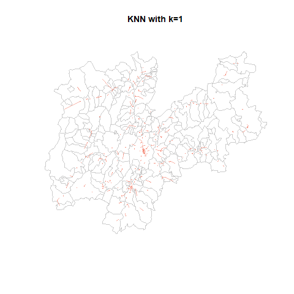
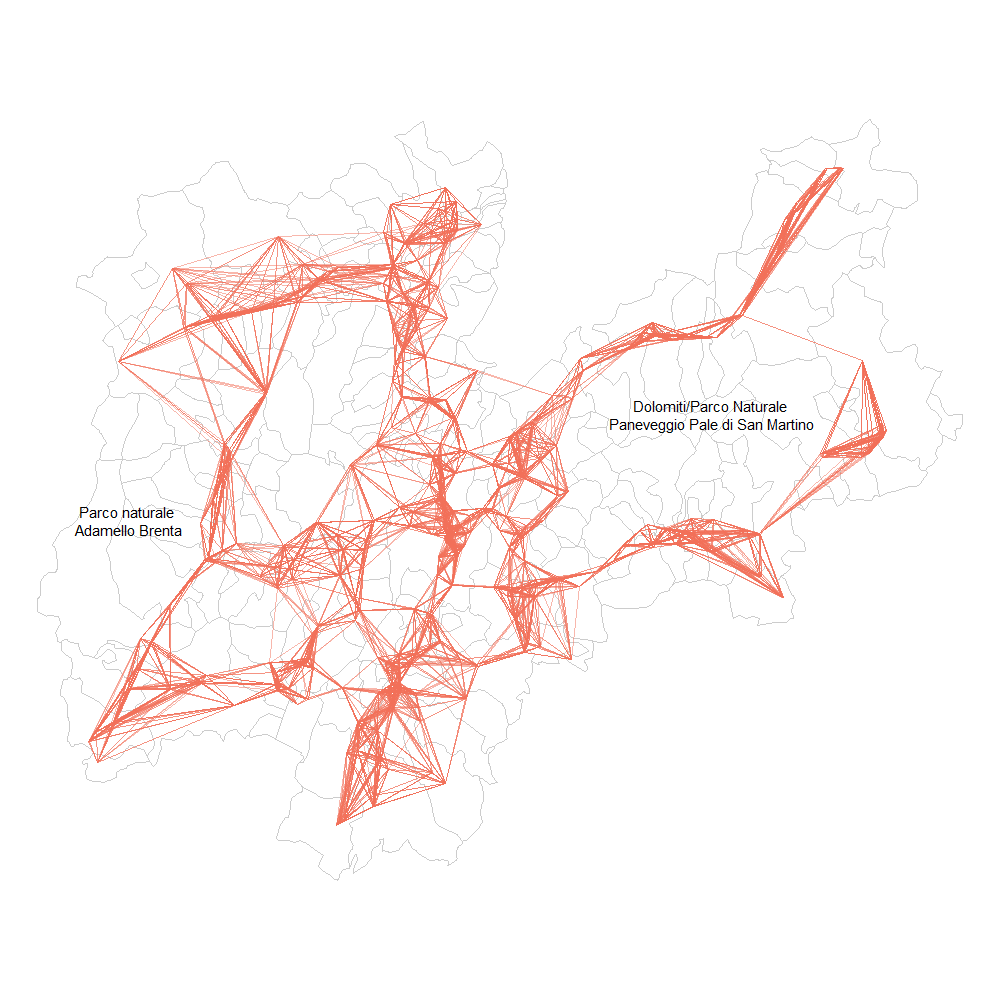

> *"Everything is related to everything else, but near things are more
> related than distant things."*
>
> First law of geography (Tobler 1970)')^[Tobler, Waldo R. 1970. "A Computer Movie Simulating Urban Growth in the Detroit Region." Economic Geography 46 (2): 234--40. http://www.geog.ucsb.edu/~tobler/publications/pdf_docs/A-Computer-Movie.pdf].

```{r message=FALSE, warning=FALSE}
# Libraries
library(tidyverse)
library(spdep)
library(rgdal)
library(sf)
library(sp)
library(rgeos)
library(terra)
library(DT)

# Function that creates a palette from 
# yellow to red
colours_palette = colorRampPalette(c("#fedb71","#FCD471","#facd71",
                                     "#f6bf70","#eea26f","#EA946F",
                                     "#e6866e","#e2786e","#e0716e","#dd696d"))
```

## Reading data

The necessary data for this type of analysis are:

* the shapefile with the aggregated data per municipality about
    schools number, students, classes and population;
* the shapefile with every single school in the Province of Trento,
    represented as points.

```{r fig.align='center', message=FALSE, warning=FALSE}
# Read municipality data
tn <- readOGR("../data/aggregated_data_per_municipality", encoding="UTF-8")
# Setting the CRS
tn <- spTransform(tn, CRS("+init=epsg:4326"))

# Function to replace NAs with 0
na.zero <- function (x) {
    x[is.na(x)] <- 0
    return(x)
}

names(tn@data)[3] = "Scuole"
names(tn@data)[7] = "Media_stud_classe"
names(tn@data)[8] = "Media_stud_scuola"
names(tn@data)[10] = "Pop_under_20"
names(tn@data)[11] = "Pop_under_20_Pop_tot"
names(tn@data)[12] = "Stud_Pop_under_20"
# Replace NAs about municipalities' number of schools with 0s
tn@data$Scuole = na.zero(tn@data$Scuole)

# Plot the municipalities in Trentino
par(mar=c(0,0,0,0))
plot(tn, axes = F, border="grey")
```

It is worth noticing from the map of school points that many of them
overlap, especially in the Adige's Valley and most populated areas, such
as Trento, Rovereto and Riva del Garda.

```{r fig.align='center'}
# Import shapefile as SpatialPointsDataFrame
schools <- readOGR("../data/Trentino/schools/schools.shp",verbose = FALSE)

# Setting the CRS
schools <- spTransform(schools, CRS("+init=epsg:4326"))

# Plot schools over Trentino's map
par(mar=c(0,0,0,0))
plot(tn, border = "grey", axes = F)
points(schools@coords, col = alpha("#f27059",0.3), cex = 1, pch = 16)
```

## Descriptive spatial statistics (global analysis)

### Centroids

<aside style="background-color: #f7c9cf; border-radius:10px; padding: 10px; margin-bottom: 20px;">

💡 The centroid of a radial projection of a region of the Earth's surface
to sea level is the region's geographical center[^2]. Therefore, the
centroid represents the centre of a polygon, computed as the mean
position of all points that make up the polygon[^3].

[^2]: Wikipedia page of Centroid,
    <https://en.wikipedia.org/wiki/Centroid>

[^3]: How to find the centre of a polygon in Python,
    <https://deparkes.co.uk/2015/02/28/how-to-find-the-centre-of-a-polygon-in-python/>

</aside>

Before starting with the global analysis of Trentino municipalities, it
is necessary to select some representative points for each municipality
as a unique reference to the spatial coordinate.

```{r fig.align='center'}
par(mar=c(0,0,0,0))
plot(tn, border="grey")
points(coordinates(tn), 
       col="red", 
       bg = "#EF798A", 
       pch = 21,  
       lwd = 1.5)
```

Commonly, the centroid is a good choice, but still some problems can emerge and the centroid may not fall inside the boundaries of the territory. In this particular case, this may happen with multipolygons shape, i.e. those municipalities represented by multiple numbers of polygons that do not share a boundary. Some examples are the municipalities of Tione di Trento, Ronzone, Stenico, Calliano, Pellizzano and Riva del Garda. Some municipalities, such as Luserna, find their centroid in another territory because of their shape.

The plot depicts all those municipalities whose centroid is outside their actual territory. As can be seen, most of them have little zones outside the main one, while others (e.g. Predaia and Luserna) just have awkward shapes.

```{r fig.align="center", dpi=300, fig.width= 11, fig.height = 11}
tn_coords = coordinates(tn)
tn@data$centroid = tn_coords
colorize = c()
for(i in 1:166){
  colorize = append(colorize, point.in.polygon(tn$centroid[i,1],
                                               tn$centroid[i,2],
                                               tn@polygons[i][[1]]@Polygons[[1]]@coords[,1],
                                               tn@polygons[i][[1]]@Polygons[[1]]@coords[,2]))
}
par(mar = c(0,0,0,0))
plot(tn, col = ifelse(colorize, "white","lightgrey"), border="grey")
text(tn_coords, labels = ifelse(colorize, "" ,tn@data$Comune), cex=0.6)
```

Instead of recurring to `coordinates()`, we could use `gCentroid` to
obtain an alternative version of centroids. For most cases, these
two versions coincide, but for those municipalities with multiple
polygons points may differ (e.g. Soraga di Fassa in the upper right
part or Tione di Trento). Since it computes a sort of mean point, making the centroid being part of other territories, the rest of the notebook will relate to the previous version (i.e. `coordinates`), despite inaccurate in some cases.

```{r fig.align='center'}
par(mar=c(0,0,0,0))
trueCentroids = gCentroid(tn,byid=TRUE)
plot(tn, border="grey")
points(coordinates(tn),pch=1, col="blue")
points(trueCentroids,pch=2, col="red")
```

⚠️ *Note that, instead, the school dataset contains points and not polygons, therefore no problem occurs with the centroid computation. Also, since many schools have the same coordinates because, in the same building, the centroids will only consider unique points, reducing the dataset from 724 to 599 unique points.*

### K-Nearest Neighbour

Since there are various definitions of neighbourhood, we will try to
explore three of them in the following sections, starting from K-nearest
neighbour.

<aside style="background-color: #f7c9cf; border-radius:10px; padding: 10px; margin-bottom: 20px;">

💡 The k-nearest neighbour criterion implies that two spatial units are
considered as neighbours if their distance is equal, or less than equal,
to the minimum possible distance that can be found amongst all the
observations. Following this definition, it can be ensured that each
spatial unit has the same number $k$ of neighbours.

</aside>

Since there is no way to choose a specific value for $k$, we can iterate
over a customized range, let's say from 1 to 20 neighbours (i.e.
schools). The following code generates an image for each value of $k$.

```{r message=FALSE, warning=FALSE}
# Saving schools coordinates
school_coords = coordinates(schools)
```

```{r eval=FALSE, message=FALSE, warning=FALSE, include=TRUE}
# Save frame per frame
for(i in 1:20){
    png(paste0("../viz/knn/",i,".png"),res=300, width=1000, height=1000)
    k <- knn2nb(knearneigh(school_coords, k = i, longlat=T))
    par(mar = c(0,0,0,0))
    plot(tn, border = "grey80", axis = tn, lwd=0.5)
    plot(k, school_coords, lwd=.6, col=alpha("#F27059",alpha=0.5), 
       cex = .3, add=TRUE, points=FALSE)
    dev.off()
}
```

⚠️ *Note that through the function `saveGIF()`*[^4] it would be possible
to save frames as animation, lowering the resolution of the image
obtained. Saving each frame will also allow users to select a customized
value for $k$ and look at how the map changes inside the website.

[^4]:saveGIF() documentation
    <https://www.rdocumentation.org/packages/animation/versions/2.4.1/topics/saveGIF>

```{r echo=FALSE, fig.align='center', fig.cap="KNN on Trentino Schools", fig.pos='h', out.width='90%'}

```

As $k$ is increased, each school finds more and more neighbours,
approaching also further points. If we focus on the first frame with
$k=1$, we may notice that some schools are isolated, since their closest
neighbour requires long lines to be reached. An example is the
municipality of Vermiglio, in the upper left part of Trentino, in the
western boundary. There are, in fact, $3$ schools in Vermiglio and one of
them is near the boundary, far from other schools. A similar situation
happens to Rabbi and Malé, to Luserna and Lavarone, but still Vermiglio
is the municipality with the longest distance between schools within the
local territory.

```{r fig.height=9, fig.width=9, message=FALSE, warning=FALSE}
k <- knn2nb(knearneigh(school_coords, k = 1, longlat=T))
par(mar = c(0,0,0,0))
plot(tn, border = "grey80", axis = tn, lwd=0.5)
plot(k, school_coords, lwd=5, 
     col=alpha("#F27059",alpha=0.5), 
     cex = .8, add=TRUE, points=FALSE)
text(tn_coords, labels = ifelse(tn@data$Comune %in% c("Vermiglio","Rabbi",
                                                      "Malé","Luserna",
                                                      "Lavarone","Predaia"),
                                tn@data$Comune, ""), cex=0.6)
```

On the other hand, at the extreme opposite, with $k=20$, we obtain the
network of schools in Trentino, looking at the $20$ closest schools
around each point. Trento and Rovereto are the most intertwined zones,
while green areas such as Adamello-Brenta Natural Park (west boundary) and
Valsugana (empty zone in the right part of the map) lack in the number
of schools. In fact, as can be seen by the length of lines, distances
between schools tend to increase by moving from the Adige Valley to the
east and west boundary.

```{r echo=FALSE, fig.align='center', fig.cap="KNN with k=20", fig.pos='h', fig.width=50, fig.height=50}

```

If instead we focus on the municipalities, we can limit to a lower $k$,
since we talk about polygons with other territories at their boundary,
while some schools' points may result isolated with low values of $k$. By
looking at the $k=5$ plot, we may notice how all municipalities are linked
to each other, despite it does not seem so in the territory above Borgo
Valsugana, where the Dolomites can be found.

```{r fig.align='center', message=FALSE, warning=FALSE}
knn1 = knn2nb(knearneigh(tn_coords, k = 1, longlat=T))
knn2 = knn2nb(knearneigh(tn_coords, k = 2, longlat=T))
knn3 = knn2nb(knearneigh(tn_coords, k = 3, longlat=T))
knn4 = knn2nb(knearneigh(tn_coords, k = 4, longlat=T))
knn5 = knn2nb(knearneigh(tn_coords, k = 5, longlat=T))

par(mar=c(0,0,0,0))
plot(tn, border = "grey80", axis = tn, lwd=0.5)
    plot(knn5, tn_coords, lwd=.6, col=alpha("#F27059",alpha=0.5), 
         cex = .3, add=TRUE, points=FALSE)
```

### Critical cut-off

<aside style="background-color: #f7c9cf; border-radius:10px; padding: 10px; margin-bottom: 20px;">

💡 According to the critical cut-off criterion, two spatial units are
considered neighbours if their distance is equal to, or less than equal
to, a certain fixed distance, the **critical cut-off**. This cut-off
distance should be greater or equal to the minimum distance necessary to
assign at least one neighbour to all points.

</aside>

Our aim in this section will be to find the minimum threshold distance
which allows all regions/points to have at least one neighbour. By
setting $k=1$ in the k-nearest neighbour, we can first compute the
nearest neighbour to each school and the relative distance and then get
the maximum distance among them.

```{r warning=FALSE}
# Critical cut-off on schools
knn1<- knn2nb(knearneigh(school_coords, k=1, longlat=T))
all.linked <- max(unlist(nbdists(knn1, school_coords, longlat=T))) 
all.linked
```

According to the results, all schools have a neighbour at least at
`r all.linked` km. This implies that the cut-off distance has to be
greater than it. However, notice from the following plot the
distribution of school distances: the majority of them is near $0$km,
following a long tail distribution. This may happen in big cities, as
Trento and Rovereto, where there are a lot of schools and the minimum
distance between them lowers.

```{r fig.align = 'center'}
distances = unlist(nbdists(knn1,school_coords,longlat=T))
ggplot()+
    geom_histogram(aes(x=distances), fill='#F27059', bins=50)+
    labs(title = "Distribution of distances between schools")+
  theme_minimal()
```

```{r}
# Critical cut-off on municipalities
knn1<- knn2nb(knearneigh(tn_coords,k=1,longlat=T))
all.linked <- max(unlist(nbdists(knn1,tn_coords,longlat=T))) 
all.linked
```

We can repeat the same computation on municipalities centroids,
discovering that every municipality has a neighbour at at least
`r all.linked` km, slightly greater than the previous cut-off distance,
which could mean that there are multiple schools in every municipality
or that they are close enough to the boundary to be neighbour of other
municipalities' schools. Analyzing the distribution of distances between
municipalities, we may notice that the majority of them distances from
others from $2$ to $4$km.

```{r fig.align="center"}
distances = unlist(nbdists(knn1,tn_coords,longlat=T))
ggplot()+
    geom_histogram(aes(x=distances), fill='#F27059', bins=50)+
    labs(title="Distribution of distances between municipalities' centroids")+
  theme_minimal()
```

We can try different neighbourhood definitions for different values of
the cut-off distance, starting from the minimum threshold found before
(i.e. $9.18$km).

```{r}
dnb10 <- dnearneigh(school_coords, 0, 10, longlat=TRUE); dnb10
dnb15 <- dnearneigh(school_coords, 0, 15, longlat=TRUE); dnb15
dnb20 <- dnearneigh(school_coords, 0, 20, longlat=TRUE); dnb20
dnb25 <- dnearneigh(school_coords, 0, 25, longlat=TRUE); dnb25
dnb30 <- dnearneigh(school_coords, 0, 30, longlat=TRUE); dnb30
```

As the cut-off distance increases, the number of links grows rapidly.
Based on the visualization, we could have stopped at 20, where nearly
every school is connected to others.

```{r fig.align='center', dpi=300, fig.width=11, fig.height=11}
plot_neighbour = function(model, coords, title){
    par(mar=c(0,0,1,0))
    plot(tn, border="grey",xlab="",ylab="",xlim=NULL)
    title(main=title, cex.main=0.8) 
    plot(model, coords, add=TRUE, col="#F27059", pch=16, lwd = 1, points=FALSE)
}

par(mfrow = c(3,2))
plot_neighbour(dnb10, school_coords, "d nearest neighbours, d = 10")
plot_neighbour(dnb15, school_coords, "d nearest neighbours, d = 15")
plot_neighbour(dnb20, school_coords, "d nearest neighbours, d = 20")
plot_neighbour(dnb25, school_coords, "d nearest neighbours, d = 25")
plot_neighbour(dnb30, school_coords, "d nearest neighbours, d = 30")
```

The same approach could be applied to municipalities data, obviously
creating a network based on the territories around a certain area.
Remembering that the cut-off threshold in this case is above $11$, we
can start with $12$.

```{r fig.align='center', dpi=300, fig.width=11, fig.height=11}
dnb12 <- dnearneigh(tn_coords, 0, 12, longlat=TRUE); dnb12
dnb16 <- dnearneigh(tn_coords, 0, 16, longlat=TRUE); dnb16
dnb20 <- dnearneigh(tn_coords, 0, 20, longlat=TRUE); dnb20
dnb24 <- dnearneigh(tn_coords, 0, 24, longlat=TRUE); dnb24
dnb30 <- dnearneigh(tn_coords, 0, 30, longlat=TRUE); dnb30

par(mfrow = c(3,2))
plot_neighbour(dnb12, tn_coords, "d nearest neighbours, d = 12")
plot_neighbour(dnb16, tn_coords, "d nearest neighbours, d = 16")
plot_neighbour(dnb20, tn_coords, "d nearest neighbours, d = 20")
plot_neighbour(dnb24, tn_coords, "d nearest neighbours, d = 24")
plot_neighbour(dnb30, tn_coords, "d nearest neighbours, d = 30")
```

Also in this case the number of connections grows rapidly, indicating
how close the municipalities are between each other. Consider that the
maximum distance within province of Trento between municipalities is
around 120km (considering the centroids, therefore the actual distance
is greater), but over the $75\%$ of municipalities has an area below
$50km^2$, which allows them to be connected with brief distances.

```{r message=FALSE, warning=FALSE}
# Quantiles of areas of municipalities within the Province of Trento
tn@data$area = round(area(tn)/ 1000000,3)
area = tn@data %>%
    arrange(desc(area)) %>%
    select(Comune, area) 
quantile(area$area)

# Find max distance within the province centroids
library(geosphere)
diff = c()
for(i in 1:166 ){
  for (j in 1:166){
 diff = append(diff, distm(tn_coords[i,],tn_coords[j,], fun = distHaversine))
  }
}
# Maximum distance between centroids within the province of Trento
max(diff)/1000
```

### Contiguity based approach

<aside style="background-color: #f7c9cf; border-radius:10px; padding: 10px; margin-bottom: 20px;">

💡 According to this approach, two spatial units are considered as
neighbours if they share a common boundary.

</aside>

Since schools are depicted as points, we will use municipalities' data to connect territories with common boundaries, i.e. multiple municipalities around. From the visualization, it is worth noticing the spiderweb created around the municipalities on the inside of Trentino, while those more disconnected are placed on the border of the Province, especially the territories on the upper right part of the map (e.g. Canazei, San Giovanni di Fassa, Mazzin, Campitello di Fassa, Soraga di Fassa, Moena).

```{r fig.align='center'}
par(mar=c(0,0,0,0))
contnb_q <- poly2nb(tn, queen=T)
plot(tn, border="grey")
plot(contnb_q, tn_coords, add=TRUE, col="#EF798A")
points(coordinates(tn), 
       col="red", 
       bg = "#EF798A", 
       pch = 21,  
       lwd = 1.5)
```

⚠️ *Note that there are 166 municipalities in the Province of Trento. By
sorting them according to the shape area, we get that the biggest areas
do not share at least one boundary, since they take place on the border
or in mountainous zones; while Trento occupies a central position.*

```{r fig.align="center"}
area%>%
  DT::datatable()
```

```{r echo=FALSE, fig.align="center", fig.cap = "Biggest municipalities in Trentino (in terms of area)", dpi=200}
par(mar = c(0,0,0,0))
plot(tn, col = ifelse(tn@data$Comune %in% area[1:10,'Comune'], "lightgrey" , "white"), border="grey")
text(tn_coords, labels = ifelse(tn@data$Comune %in% area[1:10,'Comune'], tn@data$Comune , ""), cex=0.6)
```

## Spatial Weights

After the definition of neighbourhoods, we can create spatial weights
matrices, one for each neighbour list previously created.

```{r}
# K-nearest neighbour
knn1.list = nb2listw(knn1)
knn2.list = nb2listw(knn2)
knn3.list = nb2listw(knn3)
knn4.list = nb2listw(knn4)
knn5.list = nb2listw(knn5)
# Critical cut-off
dnb12.list = nb2listw(dnb12,style="W")
dnb16.list = nb2listw(dnb16,style="W")
dnb20.list = nb2listw(dnb30,style="W")
dnb24.list = nb2listw(dnb24,style="W")
dnb30.list = nb2listw(dnb30,style="W")
# Contiguity based approach
contnb_q.list = nb2listw(contnb_q)

# List with weights lists and their names
weights = list(
    list(knn1.list, "K-nearest neighbour (k=1)"),
    list(knn2.list, "K-nearest neighbour (k=2)"),
    list(knn3.list, "K-nearest neighbour (k=3)"),
    list(knn4.list, "K-nearest neighbour (k=4)"),
    list(knn5.list, "K-nearest neighbour (k=5)"),
    list(dnb12.list, "Critical cut-off neighbourhood (d=12)"),
    list(dnb16.list, "Critical cut-off neighbourhood (d=16)"),
    list(dnb20.list, "Critical cut-off neighbourhood (d=20)"),
    list(dnb24.list, "Critical cut-off neighbourhood (d=24)"),
    list(dnb30.list, "Critical cut-off neighbourhood (d=30)"),
    list(contnb_q.list, "Contiguity-based neighbourhoord")
)
```

## Moran's I test of spatial autocorrelation

<aside style="background-color: #f7c9cf; border-radius:10px; padding: 10px; margin-bottom: 20px;">

💡 Measures of spatial autocorrelation describe the degree to which
observations at spatial locations are similar to each other.

</aside>

In the section, we will focus on Moran's I test of spatial
autocorrelation of Trentino Schools, in particular on the number of
schools and students that populate every municipality. Let's start
plotting the distribution of some features over the territory, in terms of quantiles: light colours indicate low values, while reds indicate high values for a specific feature.

⚠️ *Note that we do not hold data about students of all schools in
Trentino, therefore some data might be missing. In these cases, the
plots below will show the respective area in white*.

```{r dpi=300, fig.align="center", fig.width=20, fig.height=30}
cols = list(tn$Scuole,tn$Studenti, tn$Classi, tn$Media_stud_scuola,
            tn$Pop_under_20_Pop_tot, tn$Stud_Pop_under_20, tn$Media_stud_classe)
titles = c("Schools","Students","Classes","Mean of students per school",
           "Population under 20 over Total Population", 
           "Students over Population under 20", "Mean students per class")
colours <- colours_palette(10)

na.ignore = function(x){
  x[is.na(x)] <- -1
  return(x)
}

par(mfrow=c(4,2),mar = c(0,0,1.7,0))
for(i in 1:7){
    c = na.ignore(unlist(cols[i]))
    brks <- round(quantile(c, seq(0,1,0.1)), digits=3)
    plot(tn, col=ifelse(c==-1,
                        "#ffffff",
                        colours[findInterval(c, brks, all.inside=TRUE)]),
         main = titles[i], cex.main=2.5)
}
```

Now we can try to compute the Moran's test based on all the previous
definitions of neighborhood and with the previous features exposed,
trying to find some spatial autocorrelation.

```{r}
Neighbourhood = c()
Column = c()
Sd = c()
p_value = c()
Moran_I_statistic = c()
Mean = c()
Var = c()
Assumption = c()

# Iterate over columns
for(i in 1:length(cols)){
  # Iterate over neighbourhood
  for (w in weights) {
    c = na.zero(unlist(cols[i]))
    # Iterate over assumptions
    for (rand in c(T,F)) {
      Neighbourhood = append(Neighbourhood, w[[2]])
      res = moran.test(c, w[[1]], randomisation = rand)
      Column = append(Column, titles[i])
      Sd = append(Sd, round(as.numeric(res[[1]]),4))
      p_value = append(p_value, round(as.numeric(res[[2]]), 4))
      Moran_I_statistic = append(Moran_I_statistic, round(as.numeric(res[[3]][1]),4))
      Mean = append(Mean, round(as.numeric(res[[3]][2]),4))
      Var = append(Var, round(as.numeric(res[[3]][3]),4))
      if(rand) {
        Assumption = append(Assumption, "Randomization")
      }else{
        Assumption = append(Assumption, "Normality")
      }
    }
    Neighbourhood = append(Neighbourhood, w[[2]])
    res = moran.mc(c, w[[1]], nsim=999)
    Column = append(Column, titles[i])
    Sd = append(Sd,round(as.numeric(res[[1]]),4))
    p_value = append(p_value, round(res$p.value),4)
    Moran_I_statistic = append(Moran_I_statistic, round(res$statistic,4))
    Mean = append(Mean, "")
    Var = append(Var, "")
    Assumption = append(Assumption, res$method)
  }
}

# create df with results and show them
res_df = data.frame(Column, Neighbourhood, Moran_I_statistic, p_value,
                    Sd, Mean, Var, Assumption)

res_df %>%
  arrange(desc(abs(Moran_I_statistic)), p_value) %>%
  DT::datatable()
```


By ordering results according to the absolute value of the Moran’s I statistics, we can see that the highest statistics obtained are around the $[0.1789,0.1952]$ interval, got in all three assumptions. Albeit mean students per school seem to be the column with the highest Moran’s statistics, the p-value is not below the threshold of $0.05$ for the majority of its observations. The mean of students per school proves to be significant with neighbourhoods knn $(k=5)$ and critical cut-off with $d=16$.

On the other hand, the proportion of Population under 20 over the total population seems significant with every configuration, except for some knns neighbourhoods. However, Moran’s statistics are lower than the ones gathered considering the mean of students per school.

Both these two columns show a positive spatial autocorrelation, while negative ones are associated with the number of Students over the Population under 20, with a low p-value and minimum value $−0.1296$ for Moran’s I statistics.


```{r}
res_df%>%
  group_by(Column) %>%
  summarise("Median Moran" = median(Moran_I_statistic), "Median p-value" =  median(p_value), 
            "Mean Moran" = round(mean(Moran_I_statistic),4), "Mean p-value" = round(mean(p_value),4)) %>%
  DT::datatable()
```

Considering an aggregated table with median and mean statistics and
p-value, we can confirm that the columns with the highest statistics are:

* Mean of students per school,
* Population under 20 over Total Population,
* Students over Population under 20,
* Mean of students per class.

The low mean and median p-values for Students corroborate the absence of
spatial autocorrelation based on the number of students. Nearly the same
happens to the number of Classes and Schools.

## Moran's I test of spatial autocorrelation in OLS residuals

<aside style="background-color: #f7c9cf; border-radius:10px; padding: 10px; margin-bottom: 20px;">

💡 Since nearby observations can be similar, it may not be fair to consider these cases as independent from one another. It is noteworthy to evaluate the spatial autocorrelation in the residuals of regression models since they are supposed to be independent. If the residuals are spatially autocorrelated, the model is misspecified. The Moran’s I test can also serve as a diagnostic tool to detect the presence of spatial autocorrelation in the residuals of a linear regression model^[Spatial regression models documentation, <https://rspatial.org/raster/analysis/7-spregression.html>].

</aside>

### Residuals test with Mean of students per class

Let’s start by modelling the mean students per class with all the remaining features we have explored. The summary shows that all predictors are meaningful, except for the population under 20 over the total population and the number of students.

```{r}
LinearMean <- lm(Media_stud_classe ~ Stud_Pop_under_20+Scuole+Classi+Media_stud_scuola+Pop_under_20_Pop_tot+Studenti, tn, na.action = na.ignore)
summary(LinearMean)
```

With the step function, it is possible to simplify this model, considering only those features with high relevance, excluding those with no significance (i.e. `Pop_under_20_Pop_tot`).

```{r}
# Searching for a simplified model where every feature has high significance
LinearMean = step(LinearMean)
summary(LinearMean)
```

The plot of the studentized residuals of the linear model can give us a hint about the presence of spatial dependence in the residuals. For instance, some similarities can be located in the upper-eastern boundary.

```{r fig.align="center", dpi=300, fig.width=9,fig.height=9}
par(mar=c(0,0,1,0))
studres <- rstudent(LinearMean)
resdistr <- round(quantile(studres, seq(0,1,0.25)), digits=3)
colours_5 <- colours_palette(5)
plot(tn, col=colours_5[findInterval(studres, resdistr, all.inside=TRUE)],
     main = "Residuals quantiles in Trentino",
     border="grey20")
```

The command that allows performing Moran’s I test in the OLS residuals is the function `lm.morantest()`. In the following chunk, the test to the studentized residuals of the linear Solow Model for different specifications of the spatial weights matrix. This method will be applied to all neighbourhoods definition, except KNN with kk lower than four and the contiguity neighbourhood, since they return unusual results.

```{r}
ols_res = data.frame(Neighbourhood = c(""),
                     Moran = c(""),
                     p_value = c(""))
# Moran test on residuals
for(i in 4:11){
  t = lm.morantest(LinearMean,weights[[i]][[1]],resfun=rstudent)
  ols_res = rbind(ols_res, c(weights[[i]][[2]],
                             t$estimate['Observed Moran I'],
                             t$p.value))
}
ols_res$Moran = as.numeric(ols_res$Moran)
ols_res$p_value = as.numeric(ols_res$p_value)
ols_res %>%
  arrange(desc(abs(Moran))) %>%
  filter(!is.na(Moran)) %>%
  DT::datatable()
```

The obtained results provide a negative spatial autocorrelation, but the p-value is far from being below the threshold to confirm this hypothesis. Therefore, no spatial autocorrelation is found in the residuals of this model.

### Residuals test with Pop under 20 over total population

By focusing instead on the population under 20 over the total population for each municipality, we obtain from the summary that only the mean students per school is highly significant, while the students over population under 20's p-value is slightly above $0.05$.

```{r}
LinearPop <- lm(tn$Pop_under_20_Pop_tot ~ Stud_Pop_under_20 + Scuole + 
                  Classi + Media_stud_scuola + Media_stud_classe + Studenti, tn)
summary(LinearPop)
```

By applying the step function, the mean of students per class and the
number of classes are erased. However, the adjusted r-squared is too low
to guarantee the quality of this model.

```{r}
# Searching for a simplified model where every feature has high significance
LinearPop = step(LinearPop)
summary(LinearPop)
```

```{r}
ols_res = data.frame(Neighbourhood = c(""),
                     Moran = c(""),
                     p_value = c(""))
# Moran test on residuals
for(i in 4:11){
  t = lm.morantest(LinearPop,weights[[i]][[1]],resfun=rstudent)

  ols_res = rbind(ols_res, c(weights[[i]][[2]],
                             t$estimate['Observed Moran I'],
                             t$p.value))
}
ols_res$Moran = as.numeric(ols_res$Moran)
ols_res$p_value = as.numeric(ols_res$p_value)
ols_res %>%
  arrange(desc(abs(Moran))) %>%
  filter(!is.na(Moran)) %>%
  DT::datatable()
```

In this case, instead, we can pay attention to the p-value, which is above $0.05$ in all cases, except for knn with $k=5$. This may indicate the presence of spatial autocorrelation in the residuals and, consequently, that the model is misspecified. Equivalent results have been obtained by rotating and discarding some predictors.

If spatial autocorrelation is present it will violate the assumption about the independence of residuals and call into question the validity of hypothesis testing^[Spatial Autocorrelation, https://ibis.geog.ubc.ca/courses/geob479/notes/spatial_analysis/spatial_autocorrelation.htm#], leading to the rejection of the Population under 20 over the total population. However, since the spatial autocorrelation is found only in a single neighbourhood, it will still be studied in the next sections.

By looking at the plot we can see how the residuals in the most populated areas, as Trento and Rovereto, are low (i.e. yellow), while smaller municipalities around are red (i.e. high residuals).

```{r fig.align="center", fig.width=9,fig.height=9}
par(mar=c(0,0,1,0))
studres <- rstudent(LinearPop)
resdistr <- round(quantile(studres, seq(0,1,0.25)), digits=3)
plot(tn, col=colours_5[findInterval(studres, resdistr, all.inside=TRUE)],
     main = "Residuals quantiles in Trentino")
```

## Local Analysis

<aside style="background-color: #f7c9cf; border-radius:10px; padding: 10px; margin-bottom: 20px;">

The Moran's I statistic is a global measure, therefore it does not allow
to identify the local patterns of spatial autocorrelation. In many
circumstances, it may be also interesting to assess the presence of local
spatial clusters and verify the specific contribution of each
statistical unit to the global pattern of spatial dependence. Local
spatial autocorrelation can be investigated by the means of the Moran
scatterplot and the Local Moran's I.

💡 The Moran scatter plot consists of a plot with the spatially lagged
variable on the y-axis and the original variable of interest on the
x-axis. The slope of the linear fit to the scatter plot equals Moran's
I, while the two dashed lines represent the mean values of the x-axis
(vertical line) and the y-axis (horizontal line).

These two lines help to decompose the scatterplot into four quadrants:

* HH: the *upper right quadrant*, where both x and y are above the
    average;
* HL: the *lower right quadrant*, with x above average and y below;
* LH: the *upper left quadrant*, with x below the average and y above;
* LL: the *lower left quadrant*, with both x and y below the average.

The regions which fall into the HH and LL quadrants are characterized by
positive spatial autocorrelation and are surrounded by regions with
similar values. Conversely, HL and LH quadrants identify local patterns
of negative spatial autocorrelation since they collect the regions with
a high (respectively low) value of x and, in opposition, a low
(respectively high) value of y. These regions are surrounded by other
regions with dissimilar values.

</aside>

### Population under 20 over Total Population

#### Moran's Scatterplot on Population under 20 over Total Population

```{r message=FALSE, warning=FALSE, include=FALSE}
mps = list()
for (w in weights) {
    mps = append(mps, list(moran.plot(
        na.zero(tn@data$Pop_under_20_Pop_tot), 
        listw = w[[1]], 
        labels = tn$Comune,
        return_df=T)))
}
par(mfrow = c(4,3))
i = 1
plots = list()
for(mp in mps){
    xname <- attr(mp, "xname")
    p = ggplot(mp, aes(x=x, y=wx)) + geom_point(shape=1) + 
        geom_smooth(formula=y ~ x, method="lm", color = "#EF798A", fill="#EF798A") + 
        geom_hline(yintercept=mean(mp$wx), lty=2) + 
        geom_vline(xintercept=mean(mp$x), lty=2) + theme_minimal() + 
        geom_point(data=mp[mp$is_inf,], aes(x=x, y=wx), shape=9) +
        geom_text(data=mp[mp$is_inf,], aes(x=x, y=wx, label=labels, vjust=1.5), size=3) +
        xlab(xname) + ylab(paste0("Spatially lagged ", xname))+
        labs(title=weights[i][[1]][[2]])
    plots = append(plots, p)
    ggsave(p, filename = paste0("pop_20_tot_",weights[i][[1]][[2]],".png"), path = "../viz/moran_scatterplot/", dpi=300)
    i = i+1
}
```

The following grid of images shows Moran's Scatterplot within all
different notions of neighbourhoods. The membership of municipalities
inside a quadrant or another changes according to the neighbourhood
definition. For instance, Novaledo often switches from HH to HL quadrant
and Valfloriana from LH to LL and vice versa. Also, since this feature is
a proportion that goes from $0.10$ to $0.24$, many municipalities
overlap or assume the same value (columns of dots). Nevertheless, some
outliers are noticeable, represented with a different style and their
label.

As stated forehead, the quadrants crossed by the pink line and its confidence
interval show the municipalities with similar proportion of students
population over the total one (i.e. positive spatial autocorrelation).
An example is the relationship between **Novaledo** and
**Vignola-Falesina**, which are usually in the same HH quadrant, have a
high proportion of students and they are close, geographically talking.
On the opposite side, **Cinte Tesino** and **Castello Tesino** show a
low value for students over the population.

On the other hand, municipalities on the remaining quadrants, have
dissimilar values if they belong to opposite quadrants. For example,
**Fierozzo** and **Frassilongo** share a boundary, but their proportion
of students is $0.22$ and $0.15$ respectively, enhancing a big
dissimilarity between these two municipalities.

```{r echo=FALSE, message=FALSE, warning=FALSE, out.width="50%"}
library(knitr)
myimages<-list.files("../viz/moran_scatterplot", pattern = "pop_20_tot_", full.names = TRUE)
include_graphics(myimages)
```

This chunk shows how many municipalities belong to a specific quadrant,
based on the different concepts of neighbourhood. It seems like $15$ or
less over $166$ municipalities have a spatial autocorrelation and belong
to a specific quadrant. These hotspots are visualized with a colour, whose association is related to the membership to a specific quadrant, as described by the legend.

```{r include=FALSE}
# PLOTTING REGIONS OF INFLUENCE ABOUT STUDENTS OVER POPULATION UNDER 20
color_mapping = list("LL" = "#FEDB71",
                     "LH" = "#F6Bf70",
                     "HL" = "#E6866E",
                     "HH" = "#E0716E",
                     "None" = "white")
define_quadrants = function(obs, listw){
  obs = na.ignore(obs)
  hotspot <- as.numeric(row.names(as.data.frame(summary(moran.plot(
    obs, 
    listw = listw,
    return_df=F)))))
  tn$wx <- lag.listw(listw, obs)
  quadrant <- rep("None", length(obs))
  for(i in 1:length(hotspot))  {
    if (obs[hotspot[i]]>mean(obs) & tn$wx[hotspot[i]]> mean(tn$wx)) 
      quadrant[hotspot[i]] <- "HH" 
    if (obs[hotspot[i]]>mean(obs) & tn$wx[hotspot[i]]< mean(tn$wx)) 
      quadrant[hotspot[i]] <- "HL" 
    if (obs[hotspot[i]]<mean(obs) & tn$wx[hotspot[i]]<mean(tn$wx)) 
      quadrant[hotspot[i]] <- "LL" 
    if (obs[hotspot[i]]<mean(obs) & tn$wx[hotspot[i]]>mean(tn$wx)) 
      quadrant[hotspot[i]] <- "LH"
  }
  return(quadrant)
}
quadrants.knn = define_quadrants(tn$Pop_under_20_Pop_tot, knn5.list)
quadrants.cont = define_quadrants(tn$Pop_under_20_Pop_tot, contnb_q.list)
quadrants.dnb = define_quadrants(tn$Pop_under_20_Pop_tot, dnb20.list)
```

Since the membership to quadrants is divided over the three different
concepts of neighbourhood, we can observe that the critical cut-off
neighbourhood has no hotspot in the HH quadrant, which represents the
majority of municipalities for the contiguity approach.

```{r echo=FALSE}
table(quadrants.knn)
table(quadrants.dnb)
table(quadrants.cont)
```

To better visualize the position of the municipalities highlighted in previous scatterplots, the following map shows in white the municipalities with no quadrant and in colour the ones inside the Moran’s quadrants. In particular, this map will be served in three different configurations, one for each notion of the neighbourhood, choosing a random $k$ for knn and $d$ critical cut-off. This choice is because different neighbourhoods lead to different hotspots, i.e. the points that emerge over others in the Moran’s scatterplot.

⚠️ *It is suggested to open the image in a new window to better read
municipalities labels, whose size has been reduced for readability
issues.*

```{r dpi=300, fig.align="center", fig.width=11, fig.height=15}
par(mfrow=c(3,1))
par(mar=c(0,0,0,0))
quadrants = list(list(quadrants.knn,"KNN"), list(quadrants.dnb,"Cut-off"), list(quadrants.cont,"Contiguity"))
for(l in quadrants){
  colourization = unlist(color_mapping[l[[1]]])
  par(mar=c(0,0,1,0))
  plot(tn, col=colourization, border = "grey", main=paste0("Regions with influence on students over population under 20 (neighbourhood = ",l[[2]],")"))
  legend(x=11.38, y=45.95, legend=c("Low-Low", "Low-High", "High-Low", "High-High","None"),
         fill=unlist(color_mapping), bty="n", cex=0.8)
  text(tn_coords, labels = ifelse(l[[1]]=="None", "" ,tn@data$Comune), cex=0.7)
}
```

As can be noticed, while critical cut-off and knn focus on the same
eastern area of Trentino, the contiguity approach selects municipalities
all over the province, in particular Trento and Rovereto, the most
populated ones, and the least populated ones on the border.

While knn and contiguity show Novaledo as HH, KNN and Cut-off also show
Frassilongo, Valfloriana, Castello Tesino and Cinte Tesino (and others
not always highlighted before), described above as recurring ones in all quadrants but HH.

```{r}
# Municipalities in common between KNN and cut-off
tn$Comune[quadrants.knn != "None" & quadrants.dnb != "None"]

# Novaledo in common in contiguity and knn
tn$Comune[quadrants.cont != "None" & quadrants.knn != "None"]

# Nothing in common between contiguity and cut-off
tn$Comune[quadrants.cont != "None" & quadrants.dnb != "None"]
```

#### Local Moran's I

<aside style="background-color: #f7c9cf; border-radius:10px; padding: 10px; margin-bottom: 20px;">

The Moran scatterplot represents a useful and intuitive visual
representation of the local patterns of spatial association but cannot
provide the statistical significance of the results. As a consequence,
in order to assess the significance of the revealed pattern, we may rely
on the so-called Local Moran's I index.

💡 For each unit $i$, the Local Moran's $I_i$ is defined as:

$$
I_{i}=\frac{\left(x_{i}-\bar{x}\right) \sum_{j=1}^{n} w_{i j}\left(x_{j}-\bar{x}\right)}{\frac{\sum_{j=1}^{n}\left(x_{i}-\bar{x}\right)^{2}}{n}}
$$ 

By summing all the $n$ Local Moran's $I_i$, we get the global Moran's
I^[Anselin Luc. 1995. "Local Indicators of Spatial Association---LISA." Geographical Analysis 27 (2): 93--115.] ^[Moran, P. A. P. 1950. "Notes on Continuous Stochastic Phenomena.", Biometrika 37 (1/2): 17--23].

</aside>

Local statistics can be tested for deviations using the hypothesis of
absence of local spatial autocorrelation and hence can provide the
statistical significance of the local spatial patterns detected by the
Moran scatterplot. In particular, the function `localmoran()` provides:

* Local Moran's statistic $I_i$;
* the expectation of the statistic $E(I_i)$;
* the variance of the Local Moran's statistic $Var(I_i)$
* standard deviate of the Local Moran's statistic $Z_i$;
* p-value of the Local Moran's statistic $P(z != E(I_i))$.

By sorting results according to the municipality with highest absolute value of the Local Moran statistic $I_i$ and by filtering those whose p-value is below $0.05$, we obtain the areas with highest statistical significance of the local spatial patterns, in a clearer way than the Moran scatterplot. Specifically, **Sagron Mis**, **Cinte Tesino** and **Castello Tesino** seem to be the municipalities with highest Local Moran's, but comparing the top municipalities in lmI with those in the quadrants computed through the scatterplot, we may notice that only 41% of municipalities identified through the plot are spatially significant in the Local Moran's.

```{r}
lmI <- localmoran(tn$Pop_under_20_Pop_tot, dnb24.list, 
                  na.action = na.exclude)
lmI = data.frame(lmI) 
rownames(lmI) = tn$Comune

# List of municipalities ordered by Local Moran's I
# and below 0.05 p-value
lmI_sign = lmI%>%
  filter(lmI$Pr.z....E.Ii..<0.05) %>%
  arrange(desc(abs(Ii)))
DT::datatable(lmI_sign)

# Proportion of significant municipalities in Moran's Scatterplot
# versus those identified through Local Moran's
sum(c(tn$Comune[quadrants.knn != "None" | 
                                 quadrants.dnb != "None" | 
                                 quadrants.cont != "None"]) %in% rownames(lmI_sign))/dim(lmI_sign)[1]
```

The following two plots show:

* the territories where the Local Moran's values are higher (darker
    colours) and lower (lighter colours). The labels are present only
    for those municipalities whose p-value is below $0.05$. As can be
    noticed, labels are present in the extreme right of the Province of
    Trentino (e.g. Primiero San Martino di Castrozza, Castel Tesino,
    Predazzo etc), but also around the most populated areas (e.g.
    Trento, Riva del Garda etc).

```{r dpi=300, fig.width=11, fig.height=11, fig.align="center"}
par(mar=c(0,0,1,0))
brks <- sort(as.numeric(lmI[,1]))
colours <- colorRampPalette(c('#fedb71','#dd696d'))(length(lmI[,1]))
plot(tn, col=colours[findInterval(lmI[,1], brks, all.inside=TRUE)],
     border="grey30")
title(main="Local Moran's I values")
text(tn_coords, labels = ifelse(tn@data$Comune %in% rownames(lmI_sign), tn@data$Comune ,""), cex=0.7)
```

* this second plot only highlights the municipalities whose p-value is
    below the threshold of $0.05$, allowing us to understand which areas
    have the lowest and the highest p-value and therefore the level of
    statistical significance of the spatial autocorrelation shown in the
    previous plot. Madruzzo, Garriga Terme, Tesero and Ziano di Fiemme
    are the municipalities with lowest p-value, but only Madruzzo has a
    high value for the Local Moran's $I_i$, while others probably have a
    negative value for $I_i$. Other territories around Riva del Garda
    and Castello Tesino have p-values around $0.01$ and most of them
    positive spatial autocorrelation, except for Imer, Mezzano,
    Cavedine, Terragnolo, Scurele and Folgaria.

```{r dpi=300, fig.width=11, fig.height=11, fig.align="center"}
# Mapping the p-value as color
pvalue_colors = c("white","#fedb71", "#F6BF70", "#E6866E","#DD696D")
pval <- as.numeric(lmI[,5])
colpval = ifelse(pval>0.05, pvalue_colors[1],
                 ifelse(pval>0.01 & pval<=0.05, pvalue_colors[2],
                        ifelse(pval>0.001 & pval<=0.01,pvalue_colors[3],
                               ifelse(pval>0.0001,pvalue_colors[4],pvalue_colors[5])))) 
tn$colpval[pval>0.05] <- "white" 
tn$colpval[pval<=0.05 & pval>0.01] <- gray(0.9) 
tn$colpval[pval<=0.01 & pval>0.001] <- gray(0.7)
tn$colpval[pval<=0.001 & pval>0.0001] <- gray(0.4)
tn$colpval[pval<=0.0001] <- "black"

plot(tn, col=colpval)
legend(x=11.5, y=45.9, legend=c("Not significant", 
       "p-value = 0.05", "p-value = 0.01", "p-value = 0.001", 
       "p-value = 0.0001"), fill=pvalue_colors, bty="n", cex=1)
title(main="Local Moran's I significance map")
text(tn_coords, labels = ifelse(colpval == "white","", tn@data$Comune), cex=0.7)
```

Comparing the results obtained with the Scatterplots', we can state that
while the critical cut-off found significance in the eastern part (e.g.
Primiero, Predazzo, Castello Tesino etc), the contiguity approach helped
to find significance near Riva del Garda and around Trento.

### Mean of students per school

#### Moran's Scatterplot

```{r message=FALSE, warning=FALSE, include=FALSE}
mps = list()
for (w in weights) {
    mps = append(mps, list(moran.plot(
        na.zero(tn$Media_stud_scuola), 
        listw = w[[1]], 
        labels = tn$Comune)))
    print(w[[2]])
}
par(mfrow = c(4,3))
i = 1
plots = list()
for(mp in mps){
    xname <- attr(mp, "xname")
    p = ggplot(mp, aes(x=x, y=wx)) + geom_point(shape=1) + 
        geom_smooth(formula=y ~ x, method="lm", color = "#EF798A", fill="#EF798A") + 
        geom_hline(yintercept=mean(mp$wx), lty=2) + 
        geom_vline(xintercept=mean(mp$x), lty=2) + theme_minimal() + 
        geom_point(data=mp[mp$is_inf,], aes(x=x, y=wx), shape=9) +
        geom_text(data=mp[mp$is_inf,], aes(x=x, y=wx, label=labels, vjust=1.5), size=3) +
        xlab(xname) + ylab(paste0("Spatially lagged ", xname))+
        labs(title=weights[i][[1]][[2]])
    plots = append(plots, p)
    ggsave(p, filename = paste0("school_mean_",weights[i][[1]][[2]],".png"), path = "../viz/moran_scatterplot/", dpi=300)
    i = i+1
}
```

The following grid of images shows Moran's Scatterplot within all
different notions of neighbourhoods, considering the mean of students per
school. As in the previous case, the pink line has a positive slope,
whose confidence interval continues to grow by increasing the $x$ value.
Still, some differences can be noticed from one neighbourhood to another
and some municipalities, like **Mezzocorona**, **Villa Lagarina** and
**San Michele All'Adige**, continue to switch from above to below the
mean dashed line.

In the HH quadrant, **Trento**, **Rovereto**, **Mori**, **Mezzocorona**,
**Avio**, **Lavis** and **Ala** seem to be the municipalities with more
students per school in the majority of plots, but also **Brentonico**,
**Giovo** and **Nago-Torbole**, except when considering the critical
cut-off neighbourhood.

On the LH part, communities like **Drena** (surrounded by Arco, Dro and
Cavedine), **Fornace** (Baselga di Pinè and Civezzano),
**Ronzo-Chienis**, **Vallarsa** (Ala, Rovereto) and **Terragnolo**
(Rovereto, Folgaria) are those municipalities that have few students
(less than $100$ per school), but surrounded by municipalities with a
lot of them.

```{r echo=FALSE, message=FALSE, warning=FALSE, out.width="50%"}
library(knitr)
myimages<-list.files("../viz/moran_scatterplot", pattern = "school_mean_", full.names = TRUE)
include_graphics(myimages)
```

This chunk shows how many municipalities belong to a specific quadrant,
based on the different concepts of a neighbourhood. It seems like $16$ or
less over $166$ municipalities have a spatial autocorrelation and belong
to a specific quadrant. In particular, both knn and cut-off
neighbourhoods do not provide hotspots for the LL quadrant, while it
exceeds with HH municipalities, compared to contiguity neighbourhood.

```{r include=FALSE}
quadrants.knn = define_quadrants(tn$Media_stud_scuola, knn5.list)
quadrants.cont = define_quadrants(tn$Media_stud_scuola, contnb_q.list)
quadrants.dnb = define_quadrants(tn$Media_stud_scuola, dnb20.list)
```

```{r}
table(quadrants.knn)
table(quadrants.cont)
table(quadrants.dnb)
```

The map displays the membership of municipalities to each of the
quadrant in the Moran's scatterplot, while in white leaving the
remaining territories with no quadrant.

Starting with the KNN version, the Adige valley is completely in red,
showing the spatial similarity of a high number of students per school:
from Mezzocorona, to Trento, continuing to the neighbourhood of Rovereto
and the bottom-centre part of Trentino.

The cut-off neighbourhood instead considers partially the same
territories of KNN, with less focus on Rovereto and more on some LH
municipalities, as Vallarsa, Trambileno and Terragnolo.

In the end, the contiguity approach detaches itself from previous
approaches to show random municipalities, some in common with
knn and cut-off (e.g. Roverè della Luna, Lavis, Trambileno, Nago-Torbole
and Mori).

```{r dpi=300, fig.align="center", fig.width=11, fig.height=15}
par(mfrow=c(3,1))
par(mar=c(0,0,0,0))
quadrants = list(list(quadrants.knn,"KNN"), list(quadrants.dnb,"Cut-off"), list(quadrants.cont,"Contiguity"))
for(l in quadrants){
  colourization = unlist(color_mapping[l[[1]]])
  par(mar=c(0,0,1,0))
  plot(tn, col=colourization, border = "grey", main=paste0("Regions with influence on mean number of students per school (neighbourhood = ",l[[2]],")"))
  legend(x=11.38, y=45.95, legend=c("Low-Low", "Low-High", "High-Low", "High-High","None"),
         fill=unlist(color_mapping), bty="n", cex=0.8)
  text(tn_coords, labels = ifelse(l[[1]]=="None", "" ,tn@data$Comune), cex=0.7)
}
```

```{r}
# Municipalities in common between KNN and cut-off
tn$Comune[quadrants.knn != "None" & quadrants.dnb != "None"]

# Municipalities in common in contiguity and knn
tn$Comune[quadrants.cont != "None" & quadrants.knn != "None"]

# Municipalities in common between contiguity and cut-off
tn$Comune[quadrants.cont != "None" & quadrants.dnb != "None"]
```

#### Local Moran's I

This time, we will focus on the mean of students per school, whose values also include NAs that will be excluded through `na.action` parameter. As before, we create a dataframe ordered by the absolute value of Local Moran's $I_i$, filtered by the p-value below $0.05$.

```{r}
lmI <- localmoran(tn$Media_stud_scuola, dnb24.list, na.action = na.exclude)
lmI = data.frame(lmI) 
rownames(lmI) = tn$Comune

# Local Moran's I per each municipality
# below 0.05 p-value
lmI_sign = lmI%>%
  filter(lmI$Pr.z....E.Ii..<0.05) %>%
  arrange(desc(abs(Ii)))
DT::datatable(lmI_sign)

# Proportion of significant municipalities in Moran's Scatterplot
# versus those identified through Local Moran's
sum(c(tn$Comune[quadrants.knn != "None" | 
                                 quadrants.dnb != "None" | 
                                 quadrants.cont != "None"]) %in% rownames(lmI_sign))/dim(lmI_sign)[1]
```

`r dim(lmI_sign)[1]` municipalities find a significant statistic for the
local spatial autocorrelation and just $29\%$ are in common with the
ones found in the Moran scatterplots' quadrants.

The following two plots show:

* the territories where the Local Moran's values are higher (darker
    colours) and lower (lighter colours). The labels are present only
    for those municipalities whose p-value is below $0.05$. The white
    areas are those for which we do not detain students' data. Most of
    the statistically significant municipalities are in the **Valsugana** or
    around the **Rovereto/Riva del Garda** zone.

```{r dpi=300, fig.width=11, fig.height=11, fig.align="center"}
par(mar=c(0,0,1,0))
brks <- sort(as.numeric(lmI[,1]))
colours <- colorRampPalette(c('#fedb71','#dd696d'))(length(lmI[,1]))
plot(tn, col=colours[findInterval(lmI[,1], brks, all.inside=TRUE)],
     border="grey30")
title(main="Local Moran's I values")
text(tn_coords, labels = ifelse(tn@data$Comune %in% rownames(lmI_sign), tn@data$Comune ,""), cex=0.7)
```

* however, when looking at the p-value, Calliano, Terragnolo,
    Pomarolo, Volano and Nomi are the areas with the lowest p-value
    (therefore highest significance). All these municipalities can be
    found as Rovereto and Trento's neighbours. However, Nomi and
    Terragnolo have a negative spatial autocorrelation (therefore fewer
    students per school with respect to their neighbours who have
    the highest values), while Pomarolo and Volano have higher local moran's
    $I_i$ than Calliano.

```{r dpi=300, fig.width=11, fig.height=11, fig.align="center"}
# Mapping the p-value as color
pvalue_colors = c("white","#fedb71", "#F6BF70", "#E6866E","#DD696D")
pval <- as.numeric(lmI[,5])
colpval = ifelse(pval>0.05, pvalue_colors[1],
                 ifelse(pval>0.01 & pval<=0.05, pvalue_colors[2],
                        ifelse(pval>0.001 & pval<=0.01,pvalue_colors[3],
                               ifelse(pval>0.0001,pvalue_colors[4],pvalue_colors[5])))) 
tn$colpval[pval>0.05] <- "white" 
tn$colpval[pval<=0.05 & pval>0.01] <- gray(0.9) 
tn$colpval[pval<=0.01 & pval>0.001] <- gray(0.7)
tn$colpval[pval<=0.001 & pval>0.0001] <- gray(0.4)
tn$colpval[pval<=0.0001] <- "black"

plot(tn, col=colpval)
legend(x=11.5, y=45.9, legend=c("Not significant", 
       "p-value = 0.05", "p-value = 0.01", "p-value = 0.001", 
       "p-value = 0.0001"), fill=pvalue_colors, bty="n", cex=1)
title(main="Local Moran's I significance map")
text(tn_coords, labels = ifelse(colpval == "white","", tn@data$Comune), cex=0.6)
```

These results deviate from those discovered through the scatterplot,
since here two big clusters are evident, while in the plots with all
neighbourhood definitions territories with spatial autocorrelation are
quite sparse. Nevertheless, some territories are in common, especially
in the **Rovereto** area.

### Students over Population under 20

#### Moran's Scatterplot

This last inquiry is due to the great gap discovered in the choropleth map produced through a python notebook that shows the proportion of actual students over the total population under 20 years old of every municipality. It seems in fact that some municipalities host more students than those who actually live in that area, leading to the possible conclusion that students may need to move from their city to another to go to school every day.

```{r message=FALSE, warning=FALSE, include=FALSE}
mps = list()
for (w in weights) {
    mps = append(mps, list(moran.plot(
        na.zero(tn$Stud_Pop_under_20), 
        listw = w[[1]], 
        labels = tn$Comune)))
    print(w[[2]])
}
par(mfrow = c(4,3))
i = 1
plots = list()
for(mp in mps){
    xname <- attr(mp, "xname")
    p = ggplot(mp, aes(x=x, y=wx)) + geom_point(shape=1) + 
        geom_smooth(formula=y ~ x, method="lm", color = "#EF798A", fill="#EF798A") + 
        geom_hline(yintercept=mean(mp$wx), lty=2) + 
        geom_vline(xintercept=mean(mp$x), lty=2) + theme_minimal() + 
        geom_point(data=mp[mp$is_inf,], aes(x=x, y=wx), shape=9) +
        geom_text(data=mp[mp$is_inf,], aes(x=x, y=wx, label=labels, vjust=1.5), size=3) +
        xlab(xname) + ylab(paste0("Spatially lagged ", xname))+
        labs(title=weights[i][[1]][[2]])
    plots = append(plots, p)
    ggsave(p, filename = paste0("students_pop_20_",weights[i][[1]][[2]],".png"), path = "../viz/moran_scatterplot/", dpi=300)
    i = i+1
}
```

The remaining grid shows this time a negative trend of the relationship
between x and the spatially lagged x, indicating that there are few
close municipalities with a high number of students over the young
population, but most of them share dissimilar values with their
neighbours. This may be due to the problem highlighted before,
related to the movement of students across different municipalities to
go to school, especially middle, high and professional schools.

```{r echo=FALSE, message=FALSE, warning=FALSE, out.width="50%"}
library(knitr)
myimages<-list.files("../viz/moran_scatterplot", pattern = "students_pop_20_", full.names = TRUE)
include_graphics(myimages)
```

By assigning a quadrant to each municipality, we can easily access the number and the names of municipalities whose students come from other areas or that have the necessity of moving to go to school. In fact, as shown in the assignation of numbers to quadrants, the most populated areas are HL and LH, showing a trend of negative spatial autocorrelation.

```{r include=FALSE}
quadrants.knn = define_quadrants(tn$Stud_Pop_under_20, knn5.list)
quadrants.cont = define_quadrants(tn$Stud_Pop_under_20, contnb_q.list)
quadrants.dnb = define_quadrants(tn$Stud_Pop_under_20, dnb20.list)
```

```{r}
table(quadrants.knn)
table(quadrants.cont)
table(quadrants.dnb)
```

In this case, the colour mapping has been changed to highlight the
quadrants with most of the municipalities, whose values are dissimilar
(i.e. HL in red, LH in yellow).

As in the previous two analyses of the scatterplot, knn and cut-off show
more similarities than with the contiguity approach, thus pointing out
the municipalities that host more students than those who actually live
inside the territory (i.e. they welcome students from their neighbours).

The most critical situation is around **Tione di Trento**, which has a high number of students over its under 20 population, while **Valdaone**, **Selle Giudicarie**, **Porte di Rendena** and **Pelugo** lack of students. Notice however that we do not hold data about the number of students in **Valdaone** and most of them are missing in those zones.

Something similar but limited happens between **Canazei** and **Giovanni di Fassa**, since their closeness and the gap of students in the first against the abundance in the second may imply that students in Canazei move to Giovanni di Fassa to go to school.

```{r dpi=300, fig.align="center", fig.width=11, fig.height=15}
color_mapping = list("LL" = "#F6Bf70",
                     "LH" = "#FEDB71",
                     "HL" = "#E0716E",
                     "HH" = "#E6866E",
                     "None" = "white")

par(mfrow=c(3,1))
par(mar=c(0,0,0,0))
quadrants = list(list(quadrants.knn,"KNN"),
                 list(quadrants.dnb,"Cut-off"),
                 list(quadrants.cont,"Contiguity"))

for(l in quadrants){
  colourization = unlist(color_mapping[l[[1]]])
  par(mar=c(0,0,1,0))
  plot(tn, col=colourization, border = "grey", 
       main=paste0("Regions with influence on students over population under 20 (neighbourhood = ",l[[2]],")"))
  legend(x=11.38, y=45.95, 
         legend=c("Low-Low", "Low-High", "High-Low", "High-High","None"),
         fill=unlist(color_mapping), bty="n", cex=0.8)
  text(tn_coords, labels = ifelse(l[[1]]=="None", "" ,tn@data$Comune), cex=0.7)
}
```

```{r}
# Municipalities in common between KNN and cut-off
# (those that for sure host students from their neighbours)
tn$Comune[quadrants.knn != "None" & quadrants.dnb != "None"]

# Cinte Tesino in common in contiguity and knn
tn$Comune[quadrants.cont != "None" & quadrants.knn != "None"]

# Nothing in common between contiguity and cut-off
tn$Comune[quadrants.cont != "None" & quadrants.dnb != "None"]
```

#### Local's Moran I

As in the previous section, also here not all municipalities detain data about students over the population under 20, therefore missing values are excluded. Since there are only few municipalities whose p-value is below $0.05$ (i.e. **Molveno**, **Cimone**, **Aldeno** and **Storo**), the dataframe below accepts all rows whose p-value is below $0.1$.

```{r}
lmI <- localmoran(tn$Stud_Pop_under_20, dnb24.list, 
                  na.action = na.exclude)
lmI = data.frame(lmI) 
rownames(lmI) = tn$Comune

# Local Moran's I for each municipality
# filtered for those whose p-value is below 0.1
lmI_sign = lmI%>%
  filter(lmI$Pr.z....E.Ii..<0.1) %>%
  arrange(desc(abs(Ii)))
DT::datatable(lmI_sign)

# Proportion of significant municipalities in Moran's Scatterplot
# versus those identified through Local Moran's
sum(c(tn$Comune[quadrants.knn != "None" | 
                quadrants.dnb != "None" | 
                quadrants.cont != "None"]) %in%
      rownames(lmI_sign))/dim(lmI_sign)[1]
```

`r dim(lmI_sign)[1]` municipalities find a significant statistic for the
local spatial autocorrelation and just $24\%$ are in common with the
ones found in the Moran scatterplots' quadrants.

The following two plots show:

* the territories where the Local Moran's values are higher (darker
    colours) and lower (lighter colours). As usual, the white areas
    represent missing values municipalities, while labels are indicated
    *not* for the zones with statistical significance for Local Moran's I,
    but for those who show highest/lowest values for $I_i$ (let's say
    above $0.2$ and below $-0.2$). In this way, territories like **Tione
    di Trento**, **Ossana**, **Cles** and **Rovereto** are highlighted as in the
    Moran's scatterplot.

```{r dpi=300, fig.width=11, fig.height=11, fig.align="center"}
par(mar=c(0,0,1,0))
brks <- sort(as.numeric(lmI[,1]))
colours <- colorRampPalette(c('#fedb71','#dd696d'))(length(lmI[,1]))
plot(tn, col=colours[findInterval(lmI[,1], brks, all.inside=TRUE)],
     border="grey30")
title(main="Local Moran's I values")
text(tn_coords, labels = ifelse(lmI$Ii>=0.2 | lmI$Ii<=-0.2, tn@data$Comune ,""), cex=0.7)
```

* however, looking at the p-value, we can notice how it is extremely high for all observations and therefore that no local spatial autocorrelation can be confirmed for the municipalities found in the previous plot, just for **Molveno**, **Storo**, **Cimone** and **Aldeno**. Given the absence of statistical significance, we could discard the hypothesis of students overcrowding in specific areas.

```{r dpi=300, fig.width=11, fig.height=11, fig.align="center"}
# Mapping the p-value as color
pvalue_colors = c("white","#fedb71", "#F6BF70", "#E6866E","#DD696D")
pval <- as.numeric(lmI[,5])
colpval = ifelse(pval>0.05, pvalue_colors[1],
                 ifelse(pval>0.01 & pval<=0.05, pvalue_colors[2],
                        ifelse(pval>0.001 & pval<=0.01,pvalue_colors[3],
                               ifelse(pval>0.0001,pvalue_colors[4],pvalue_colors[5])))) 
tn$colpval[pval>0.05] <- "white" 
tn$colpval[pval<=0.05 & pval>0.01] <- gray(0.9) 
tn$colpval[pval<=0.01 & pval>0.001] <- gray(0.7)
tn$colpval[pval<=0.001 & pval>0.0001] <- gray(0.4)
tn$colpval[pval<=0.0001] <- "black"

plot(tn, col=colpval, border="grey30")
legend(x=11.5, y=45.9, legend=c("Not significant", 
       "p-value = 0.05", "p-value = 0.01", "p-value = 0.001", 
       "p-value = 0.0001"), fill=pvalue_colors, bty="n", cex=1)
title(main="Local Moran's I significance map")
text(tn_coords, labels = ifelse(colpval == "white","", tn@data$Comune), cex=0.6)
```


## Spatial Regression Models

### Population under 20 over the total population

In this section, we will resume the conclusions obtained in the Moran's I
test of spatial autocorrelation in OLS residuals, in particular when the
hypothesis of no spatial autocorrelation in the residuals is violated,
which happened with the Population under 20 over the total population
model.

<aside style="background-color: #f7c9cf; border-radius:10px; padding: 10px; margin-bottom: 20px;">
💡 Spatial regression approaches allow to relax the independence
assumption by incorporating a form of spatial dependence among
statistical units within the modelling framework, allowing consequently
the assessment of **spatial spillovers**. A spatial spillover occurs
when a change in the characteristics or action $x$ of spatial unit $i$
exerts a relevant influence on the outcome or action $y$ of the other
spatial units $j$. Spatial regression models are useful to quantify and
test this spatial spillovers^[LeSage, J., and R.K. Pace. 2009. Introduction to Spatial Econometrics. Statistics: A Series of Textbooks and Monographs. CRC Press].

Spatial spillovers can be:

* *local*, which imply an impact on neighbouring units that do not
    generate endogenous interaction and feedback effects. Examples of
    these specifications are the Spatial Dublin Error Model (SDEM),
    Spatial Error Model (SEM) and Lagged inDependent variable Model
    (LDM);
* *global*, which imply an impact on neighbouring units plus
    neighbours to the neighbouring units, neighbours to the neighbours,
    and so on, thus generating endogenous interaction and feedback
    effects. Examples of these specifications are the Spatial Durbin
    Model (SDM) and the Spatial AutoRegressive model (SAR)^[LeSage, J. 2014. "What Regional Scientists Need to Know About Spatial Econometrics." Review of Regional Studies 44 (1): 13--32].

</aside>

Let's start with the SDM model. The `lagsarlm()`^[lagsarlm documentation, https://cran.r-project.org/web/packages/spatialreg/spatialreg.pdf] function provides Maximum likelihood estimation of spatial simultaneous autoregressive lag and spatial Durbin (mixed) models.

As shown in the summary, only the mean of students per school is a
relevant predictor, none of the lag or the remaining predictors' p-value
is close to the $0.05$ threshold to demonstrate statistical
significance. Also, the overall p-value is above $0.5$, therefore no
significance is shown by the SDM.

```{r message=FALSE, warning=FALSE}
library(spatialreg)

# Estimate the SDM model using the Maximum likelihood estimator
SDM <- lagsarlm(Pop_under_20_Pop_tot ~ Stud_Pop_under_20 + Scuole +
                  Media_stud_scuola + Studenti, tn, listw=dnb16.list,
                type="mixed", na.action = na.ignore)
summary(SDM)
```

Same principle applies to SAR, which has an higher p-value than SDM,
indicating the absence of statistical significance. The relevance of
predictors remains unaltered.

```{r}
# Estimate the SAR model using the Maximum likelihood estimator
SAR <- lagsarlm(Pop_under_20_Pop_tot ~ Stud_Pop_under_20 + Scuole +
                  Media_stud_scuola + Studenti, tn, listw=dnb16.list, 
                na.action = na.ignore)
summary(SAR)
```

Now we skip to the local spillover specifications, starting from SDEM,
which shows no significance in terms of p-value, both of the model and
about the predictors.

```{r}
# Estimate the SDEM model using the Maximum likelihood estimator
SDEM <- errorsarlm(Pop_under_20_Pop_tot ~ Stud_Pop_under_20 + Scuole +
                     Media_stud_scuola + Studenti, tn, listw=dnb16.list,
                   etype = "emixed", na.action = na.ignore)
summary(SDEM)
```

The same happens for the SEM, except for the high relevance of the predictor " mean of students per school".

```{r}
# Estimate the SEM model using the Maximum likelihood estimator
SEM <- errorsarlm(Pop_under_20_Pop_tot ~ Stud_Pop_under_20 + Scuole +
                    Media_stud_scuola + Studenti, tn, listw=dnb16.list, na.action = na.ignore)
summary(SEM)
```

On the other hand, the LDM shows the same relevance for predictors as SEM, SAR and SDM, but a low p-value, demonstrating how significant the estimation is. 

```{r}
# Estimate the LDM model using the OLS estimator
LDM <- lmSLX(Pop_under_20_Pop_tot ~ Stud_Pop_under_20 + Scuole +
               Media_stud_scuola + Studenti,tn, listw=dnb16.list, na.action = na.ignore)
summary(LDM)
```

The calculation of impacts for spatial lag and spatial Durbin models is needed in order to interpret the regression coefficients correctly,
because of the spillovers between the terms in these data generation processes^[spdep Documentation,https://www.rdocumentation.org/packages/spdep/versions/1.0-2/topics/impacts] ^[LeSage J and RK Pace (2009) Introduction to Spatial Econometrics. CRC Press, Boca Raton, pp. 33--42, 114--115; LeSage J and MM Fischer (2008) Spatial growth regressions: model specification, estimation and interpretation. Spatial Economic Analysis 3 (3), pp. 275--304]. 

The method `impacts` returns the average direct, indirect and total impacts for the variables in the model, for the variables themselves in the spatial lag model case, for the variables and their spatial lags in the spatial Durbin (mixed) model case^[Roger Bivand, Gianfranco Piras (2015). Comparing Implementations of Estimation Methods for Spatial Econometrics. Journal of Statistical Software, 63(18), 1-36. https://www.jstatsoft.org/v63/i18/]. The indirect impact represents a proper measure of (global) spatial spillover. Indeed, it expresses, on average, how a change in $x$ reverberates on $y$ all over the sample.

Both SAR and SDM impacts on the mean of students per school are significant due to low p-values. On average, because of spatial spillovers, a change in a neighbourhood would lead to a cumulative increase of $0.000168$ (in SAR case) or $0.00009198$ (in SDM case) in the ratio of the population under 20 over the total population.

```{r}
impSAR <- impacts(SAR, listw=dnb16.list, R=100)
summary(impSAR, zstats=TRUE, short=TRUE)

#For the SD specification:
impSDM <- impacts(SDM, listw=dnb16.list, R=100)
summary(impSDM, zstats=TRUE, short=TRUE)
```

The Lagrange multiplier (LM) test of spatial dependence on OLS
residuals. In the LM test, the alternative hypothesis is explicitly
considered to contrast the null hypothesis about the absence of spatial dependence. In particular, we can explicitly express the alternative hypothesis either in the form of a SL or of a SEM. 

The function `lm.LMtests()` reports the estimates of tests chosen among 4 statistics for testing for spatial dependence in linear models, which are:

* LMerr: LM test for error dependence;
* LMlag, simple LM test for a missing spatially lagged dependent variable;
* their robust version, called RLMerr and RLMlag.

According to this diagnostic, no model has been found significant by
looking at the p-value.

```{r}
OLSmodel <- lm(Pop_under_20_Pop_tot ~ Stud_Pop_under_20 + Scuole + 
                 Media_stud_scuola + Studenti, data = tn, na.action = na.ignore)
natOLSlmTests <- lm.LMtests(OLSmodel, dnb16.list, 
                    test=c("LMerr", "LMlag", "RLMerr", "RLMlag"))
summary(natOLSlmTests)
```

In conclusion, a positive significant total impact on the proportion of
population under 20 over the total population has been found through the
mean number of students per school, implying that higher levels of
potential students in the territory lead to the increase of mean
students per school in the same neighbourhood.

### Mean of students per class

Again, we can repeat the same analysis with the mean of students per
class, using the same predictors used in the OLS residuals section (i.e.
optimal model).

Starting from SDM, all predictors seem to gain high relevance given the low p-value, while their lagged values are relevant only for the mean students per school and slightly for the number of classes. The overall p-value of the model is below $0.05$ and is therefore considered statistically significant.

```{r}
SDM <- lagsarlm(Media_stud_classe ~ Stud_Pop_under_20 + Scuole + Classi + 
                  Media_stud_scuola + Studenti, tn, listw=dnb16.list,
                type="mixed", na.action = na.ignore)
summary(SDM)
```
In SAR case instead, despite all predictors seem to have high relevance, the spatial autoregressive parameter $\rho$ (Rho) is not significant due to high p-value on both the asymptotic t-test and Likelihood ratio test, but the LM test for residual autocorrelation has low p-value, indicating the presence of spatial autocorrelation in the residuals. 

```{r}
SAR <- lagsarlm(Media_stud_classe ~ Stud_Pop_under_20 + Scuole + Classi + 
                  Media_stud_scuola + Studenti, tn, listw=dnb16.list, na.action = na.ignore)
summary(SAR)
```
In case of local spillover specifications, all predictors are relevant, but not their lagged version. The $\lambda$ (Lambda) estimator is highly significant due to low p-value on both Likelihood ratio and asymptotic t-tests.

```{r}
SDEM <- errorsarlm(Media_stud_classe ~ Stud_Pop_under_20 + Scuole + 
                     Classi + Media_stud_scuola + Studenti, tn, listw=dnb16.list,
                   etype = "emixed", na.action = na.ignore)
summary(SDEM)
```
In case of SEM instead, the estimator is not statistically significant in both tests due to p-value around $0.3$. 
```{r}
SEM <- errorsarlm(Media_stud_classe ~ Stud_Pop_under_20 + Scuole + 
                    Classi + Media_stud_scuola + Studenti, tn, listw=dnb16.list, 
                  na.action = na.ignore)
summary(SEM)
```

Also for LDM predictors are relevant, except for their lagged values. The p-value is below the $0.05$ threshold, concluding the significance of this model. 

```{r}
LDM <- lmSLX(Media_stud_classe ~ Stud_Pop_under_20 + Scuole + 
               Classi + Media_stud_scuola + Studenti,tn, listw=dnb16.list, 
             na.action = na.ignore)
summary(LDM)
```

All predictors' impacts are significant, if looking at direct and total impacts. Results show a particular significance for:

* **the number of students over the population under 20**: on average, because of spatial spillovers, a change in a neighbourhood would lead to a cumulative *increase* of $7.76$ students per class;
* **the number of classes**: on average, because of spatial spillovers, a change in a neighbourhood would also lead to a cumulative *decrease* of $0.411$ (half student per class);
* **the number of schools**: on average, because of spatial spillovers, a change in a neighbourhood would also lead to a cumulative *increase* of $0.935$ (nearly one student per class).

Also, a cumulative increase will happen by changing neighbourhoods if considering an increase in terms of the mean of students per school and number of students, with lower impact than the previous three mentioned predictors. 

```{r}
impSAR <- impacts(SAR, listw=dnb16.list, R=100)
summary(impSAR, zstats=TRUE, short=TRUE)
```

In this second case, the p-value is higher than before, but still implying significance mainly for students over population under $20$ (increase), number of schools (increase) and number of classes (decrease). 

```{r}
#For the SD specification:
impSDM <- impacts(SDM, listw=dnb16.list, R=100)
summary(impSDM, zstats=TRUE, short=TRUE)
```

Focusing on the Lagrange multiplier diagnostics for spatial dependence, let's try focusing on the same model but reducing the number of predictors to those with higher impacts on both SEM and SDM models. 

According to the summary, all statistics are significant, except for Robust Linear Model test for error dependence (RLMerr). 

```{r}
OLSmodel <- lm(Media_stud_classe ~ Stud_Pop_under_20 + Scuole + Classi, data = tn, na.action = na.ignore)
natOLSlmTests <- lm.LMtests(OLSmodel, dnb16.list, 
                    test=c("LMerr", "LMlag", "RLMerr", "RLMlag"))
summary(natOLSlmTests)
```

According to Elhorst (2010)^[Elhorst, J. P. 2010. “Applied Spatial Econometrics: Raising the Bar.” Spatial Economic Analysis 5 (1). Routledge: 9–28.], a valid comparison between two models can be made through an inferential strategy. The best specification under the ML estimation, we should:

1. Estimate the OLS model and test (with the LM test) whether the SAR or the SEM is more appropriate to describe the data;
2. If the OLS model is rejected in favour of SAR, the SEM or in favour of both models, then the SDM should be estimated;
3. Likelihood ratio (LR) tests can subsequently be used to test whether:

    * the SDM can be simplified to SAR, 
    * whether SDM can be simplified to the SEM.
    
If both hypotheses are rejected, then the SDM best describes the data. If hypothesis i) cannot be rejected, then the SAR best describes the data.

If hypothesis ii) cannot be rejected, then the SEM best describes the data, provided that the (robust) LM tests also pointed to the SEM. We can perform LR tests of restrictions on the parameters of spatial models using the function `anova()`.

With the likelihood ratio test, we can see if the SAR can be simplified by the SDM, which is false due to the high p-value. On the other hand, performing the same test on SDM and SEM makes us come to the conclusion that SDM cannot be simplified by SEM, because of the p-value above $0.05$ threshold. 

```{r}
# Test hypothesis i)
anova(SAR, SDM)

# Test hypothesis ii)
anova(SDM, SEM)
```

Since both hypothesis are rejected, SDM best describes data.

In conclusion, a positive significant impact on the mean students per class has been found through the number of students over the population under 20 and the number of schools, implying that higher levels of students per class in the territory lead to the increase in the number of schools and students ratio over young population in the same neighbourhood. The same applies to the number of classes, with a negative impact since the more classes there are, the more spread students will be among them. 


